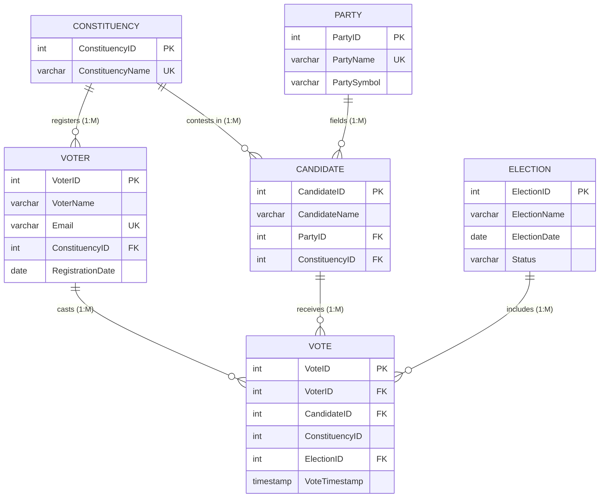

# VoteSecure – Entity-Relationship (ER) Diagram

---

## Entity Relationship Overview

1. **Constituency $\rightarrow$ Voter (1 : M):** A department has multiple registered voters; each voter belongs to one department.
2. **Constituency $\rightarrow$ Candidate (1 : M):** A department has multiple candidates contesting elections.
3. **Party $\rightarrow$ Candidate (1 : M):** A student party fields multiple candidates across departments.
4. **Voter $\rightarrow$ Vote (1 : M):** A voter casts ballots in elections, restricted to **at most 1 vote per election** via `UNIQUE (VoterID, ElectionID)`.
5. **Candidate $\rightarrow$ Vote (1 : M):** A candidate receives votes from voters within their constituency.
6. **Election $\rightarrow$ Vote (1 : M):** An election contains all ballots cast during that event.
